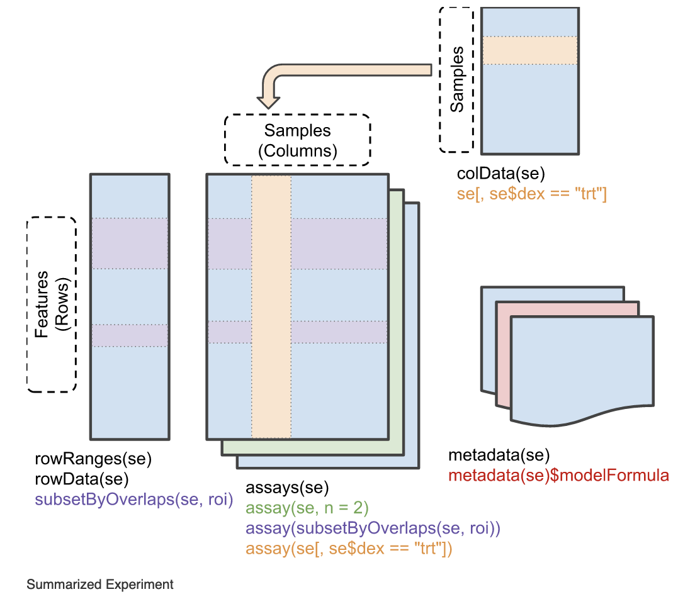

```{r setup, include=FALSE}
knitr::opts_chunk$set(echo = TRUE,
                      eval = FALSE,
                      message=FALSE,
                      error=FALSE)
knitr::opts_knit$set(root.dir = '../')
library(webexercises)
```


#### Prepare environment

Set your working directory and load the libraries we will need.

```{r eval=TRUE}
# set working directory
#setwd("~/Documents/git_projects/PoE23/")
setwd("~/Documents/teaching/principals_of_evolution23/PoE23_rnaseq/")

# install pacman if not already installed
if (!require("pacman")) install.packages("pacman")

# use pacman to load libraries
pacman::p_load(tidyverse, DESeq2,viridis,scales)

```


## Background

In the 1st exercise, we explored the RNA-Seq count data from salmon. We saw that this data:

1. Has counts, abundances, lengths.
2. Comes from different experimental treatments (dark vs. light backgrounds)
3. Comes from different tissues (liver, dorsal skin, ventral skin)

The aim of this exercise is to go through a workflow for identifying genes that are significantly deferentially expressed when comparing two experimental treatments. We saw that the liver and skin samples were very different in their expression profiles. For this exercise, we will therefore only focus on the skin samples. This workflow entails the following general steps:

1. Import quantification data.
2. Perform a differential gene expression analysis using `DESeq2`.
3. Evaluate the quality of the results.
4. Summarize the results.

## Load data

We will start by loading the quantification data from `salmon` and the design matrix of the experiment, just like we did for the previous exercise

```{r eval=TRUE}
txi<-readRDS("./data/salmon_gene_counts.rds")
samples<-read_csv("./data/design_matrix.csv")
```

### Subset data

Because we only want to be working with one tissue (in this case skin), we want to filter out all of the remaining data from the design matrix and the expression data. To make things a little more convenient, we will also create a new variable (`condition`) which combines the `treatment` and `side` variable.

```{r}
samples <- samples %>%
  filter(tissue=="skin") %>%
  mutate(condition=as.factor(paste(treatment, side, sep="_")))

## filter txi matrices
txi$abundance<-txi$abundance[,samples$sample_id]
txi$counts<-txi$counts[,samples$sample_id]
txi$length<-txi$length[,samples$sample_id]
```

## Make a DESeqDataSet object

We can now combine the design matrix and the expression data into a format that DESeq2 likes. `tximport` plays very well with DESeq2, so this is easy!

```{r}
dds <- DESeqDataSetFromTximport(txi,
                         colData = samples,
                         design = ~ condition)
```

The dataset should have successfully been stored as a `DESeqDataSet` object. You should see that it has imported the `counts` and the `length` data from the `txi` object and the sample information from the design matrix. lets take a look at this object:

```{r}
dds
```

You may have seen this type of object before, but it most likely is not as common as other types.

> _Question:_ What is the structure of this object? Is there anything you are unfamiliar with?

`r hide("Show Answer")`

It is an S4 object system. R has three object oriented systems: S3, S4 and R5. You can read up about them [here](http://adv-r.had.co.nz/OO-essentials.html). For now, you just need to know that most often you will work with S3 objects, which can be conveniently accessed with `$` for example. S4 objects are a little different. They usually have data stored in "slots" which are indicated with `@`.
`r unhide()`


More specifically, it is a subclass of `RangedSummarizedExperiment`.



This is a format widely used by packages in the Bioconductor ecosystem. The core of the object are assays (a single or multiple matrices) with samples as columns and freatures as rows. Features in this case are our genes or transcripts, but they may also be chromosomal coordinates etc. 

Working with this type of object sometimes requires specific "accessor" functions (or methods) to get at data stored in 'slots'. For example, the `dds` object we created, has two assays: `counts` and `avgTxLength`. We can access them with `assays()` function (note: different from `assay()`), or specific functions for specific assays (if these are available)

```{r}
names(assays(dds)) # list the stored assays
assays(dds)[["counts"]] %>% head() # uses assays() function with typical indexing operators to get e.g. the counts 
counts(dds) %>% head() # uses counts() function to specifically extract the counts
```

We can also access information about the columns:

```{r}
colData(dds)
```

In this case, this is the experimental information we provided with the design matrix!

And we can also access the row data.

```{r}
rowData(dds)
```

In this case it is empty, but you could imagine that you may have gene annotations here, or loci position information etc.

Feel free to read up more on this kind of `SummarizedExperiment` data object [here](https://bioconductor.org/packages/devel/bioc/vignettes/SummarizedExperiment/inst/doc/SummarizedExperiment.html).

> _Question:_ What is different about count data stored in the dds object compared to the raw count data we imported?

`r hide("Show Answer")`

```{r}
head(counts(dds))
head(txi$counts)
```

One of the The decimal counts have been rounded off to make them integers.
`r unhide()`


## Pre-filtering

You may have seen that in some workflows or examples, people filter out genes that have generally very low counts, or even filters whose counts don't vary very much across samples. In theory, this is not necessary with DESeq2 as it will handle this on the fly (read more [here](http://bioconductor.org/packages/devel/bioc/vignettes/DESeq2/inst/doc/DESeq2.html#pre-filtering)), but reducing the size of the matrix can greatly speeding up downstream calculations and reduce the memory requirements. 

As we saw in the previous exercise, there are many liver-specific genes that most likely are not deferentially expressed in skin. There are therefore many rows of genes with 0 or very low counts. We can at least remove those:

```{r}
# keep only rows with with counts summing up to 10 or more
dds <- dds[rowSums(counts(dds)) >= 10,]
```

## Differential Expression Analysis

The ultimate goal of running such an analysis is to see if a given gene is expressed to a different degree in one condition vs. another condition. This sounds almost like a T-test kind of problem, but things are not that simple. In this exercise, I don't want to focus too much on the theory, but it might be worthwhile to refresh ourselves what some of the "problematic" features of the data are:

* Many counts are low, or even zero.
* RNAseq data tends to exhibit overdispersion: the variance is much greater than the mean.
* The target contigs (e.g. genes) are of different lengths. You would expect longer contigs to also have more mapped reads.
* Each library (sample) consists of a different total number of reads.
* RNAseq experiments tend to have few (usually three) replicates per condition.
* There are typically thousands of genes, which means you are repeating the same pairwise test thousands of times.
* Highly expressed genes tend to 'eat up' more reads during sequencing, meaning that genes that are less expressed tend to be underrepresented. This means changes in expression in highly expressed genes are easier to detect than changes in genes that are expressed at lower levels.
  
The differential expression analysis in `DESeq2` takes several steps to try to deal with these problems. At its core it fits generalized linear models with a negative binomial distribution to each gene. It takes into account the estimated counts per gene, normalized by library size, but also takes into account the size of the target genes/transcripts and calculates a dispersion parameter, which tells you about how far the observed count is from the mean counts estimated by the model.
  
It then performs a pairwise comparison of the level of expression per gene in condition A vs. condition B. It uses the models per gene to estimate coefficients and standard error for each sample group (i.e. for  condition A and condition B). These coefficients are the estimates of log2 fold change. 
  
To test whether this log2 fold change for a given gene is significant, it then applies a statistical test (Wald test), to test the hypothesis that the parameter (log 2 fold change) is significantly different from 0. A multiple test correction is then applied, by default a version of the Benjamini-Hochberg False Discovery Rate (FDR). This is done by ranking the genes by p-value, then:
  
$adjusted\ p\ value = p\ value * \frac{total\ number\ of\ tests}{rank}$
  
In short, `DESeq2` does the following:

1. Estimation of size factors (control for differences in the library size of the sequencing experiments)
2. Estimation of dispersion (e.g. for problem of large within-group variability and low sample sizes)
3. Negative binomial GLM fitting (good for modeling discrete counts with over-dispersion)
4. Wald statistics calculation and multiple testing correction (statistical significance testing)

These are all done with a single convenient function:

```{r}
dds <- DESeq(dds)
dds
```

> _Note: it looks like we are "overwriting" the `dds` object, but really, we are just adding more inforamtion to it_

This incredibly convenient function has done all of the heavy lifting for us, and it has even run some pair-wise tests already, based on the `~condtion` variable we set.  

We can access the names of the pairwise tests like so:

```{r}
resultsNames(dds)
```

> _Question:_ Is there anything unexpected about the list of pair-wise tests?

`r hide("Show Answer")`
We had 4 treatment levels, which should result in a total of 6 pairwise comparisons. But here, there are only 3.
   
This is because DESeq2 compares everything to a baseline condition. If this is not specified, it will use the first alphabetic factor level, which in this case is "black_dorsal". As a result only xxx_vs_black_dorsal comparisons are made.

This is an important detail to remember: **the second factor is always considered to be the "base level" or "control" variable.**

`r unhide()`

## Examining differential expression analysis results 

We can extract the results for the pair-wise tests from the `dds` object like so:

```{r}
res<-results(dds)
res
```

If we don't specify anything else, it will extract just the first comparison. In this case "white ventral vs black dorsal". This table has the following information:

1. Rows are genes.
2. Per gene, there are 6 metrics:
  * baseMean: mean of normalized counts for all samples divided by size factor
  * log2FoldChange: The effect size estimate. This value indicates how much the gene or transcript's expression seems to have changed between the comparison and control groups. This value is reported on a logarithmic scale to base 2.
  * lfcSE: The standard error estimate for the log2 fold change estimate
  * stat: The value of the test statistic for the gene or transcript.
  * pvalue: P-value of the test for the gene or transcript.
  * padj: Adjusted P-value for multiple testing for the gene or transcript.

> _Question:_ Is there anything unexpected about the adjusted p-values?

`r hide("Show Answer")`
Some of the adjusted p-values are `NA`. This is what the `DESeq2` handbook tells us:

"If a row is filtered by automatic independent filtering, for having a low mean normalized count, then only the adjusted p value will be set to NA. Description and customization of independent filtering is described below".

Let's check some of those counts with `NA` padj:

```{r}
counts(dds)[rownames(res)[is.na(res$padj)],] %>% head(15)
```

Indeed! all have very low counts!! they are therefore unreliable, and should rightfully not be included in the results.
`r unhide()`

We could also extract results of specific comparisons. there are two ways to do this:

```{r}
# 1. using the result names:
results(dds, name="condition_white_dorsal_vs_black_dorsal")
# 2. using contrasts:
results(dds, contrast=c("condition","white_dorsal","black_dorsal"))
```

These two approaches should be largely the same (though baselines are treated slightly differently), but the second has some advantages. Namely, you can change the factor order (in our case, there is not really a clear control/treatment, right?), and, you can calculate results using different baseline than was included in the original, automatize run. lets make four results objects, comparing the dorsal and ventral skins within each treatment, and the dorsal skins across treatments:

```{r}
# white dorsal vs white ventral
res_wD_wV<-results(dds, contrast=c("condition","white_dorsal","white_ventral"))
# black dorsal vs black ventral
res_bD_bV<-results(dds, contrast=c("condition","black_dorsal","black_ventral"))
# black dorsal vs white dorsal
res_bD_wD<-results(dds, contrast=c("condition","black_dorsal","white_dorsal"))
# black ventral vs white ventral
res_bV_wV<-results(dds, contrast=c("condition","black_ventral","white_ventral"))
```

We can now summarize these results tables:

```{r}
summary(res_wD_wV, alpha=0.05)
summary(res_bD_bV, alpha=0.05)
summary(res_bD_wD, alpha=0.05)
summary(res_bV_wV, alpha=0.05)
```

This returns the number of up-regulated genes (LFC>0) and down-regulated genes (LFC<0) with respect to the control variable. Other information is also given, such as the number of outliers and low counts. 

> _Question:_ What do you notice about these results?

`r hide("Show Answer")`

It seems like the dorsal vs. ventral comparisons are producing many more up and down regulated genes than the black vs. white comparison. This indicates that not all skin is the same! At the level of gene expression, the change in pigmentation on the dorsum is minimal compared to the difference in gene expression between dorsal and ventral skin of much similar colour!
`r unhide()`


## MA plots

The typical plot to show the distribution of differentially expressed genes, is a "MA-plot". Here, we plot the mean of normalized counts against the log fold change, with a canned plotting function from the `DESeq2` package.

```{r}
par(mfrow=c(2,2))
# single plot
DESeq2::plotMA(res_wD_wV)
DESeq2::plotMA(res_bD_bV)
DESeq2::plotMA(res_bD_wD)
DESeq2::plotMA(res_bV_wV)
par(mfrow=c(1,1))
```


> _Question:_ Have you seen this kind of plot before? What can we say from these plots?

`r hide("Show Answer")`
* It demonstrates that only genes with a large average normalized count contain sufficient information to be significant
* The same as from the summary() function:
  * Dorsal-ventral comparisons result in more differentially expressed genes (DEGs), than black-white comparisons?
  * DEGs are more or less evenly up (positive fold changes) and down (negative fold changes) regulated for each comparison
* There is a lot of noise for genes with genes with low normalized counts.
`r unhide()`

We can squeeze even more information out of these kinds of plots by getting creative with ggplot.

```{r}
res_bD_bV %>%
  as.data.frame() %>%
  ggplot(aes(baseMean, log2FoldChange, colour=padj)) +
  geom_point(size=1) + 
  scale_y_continuous(limits=c(-5, 5), oob=squish) + # oob from the scales package is needed to "squish" points falling outside the axis limits
  scale_x_log10() +
  geom_hline(yintercept = 0, colour="red", size=1, linetype="longdash") +
  labs(x="mean of normalized counts", y="log fold change") +
  scale_colour_viridis(direction=-1, trans='sqrt') +
  geom_density_2d(colour="blue", size=0.5) +
  theme_bw()
```

Here, we can see more clearly that genes with low counts do not have p-adjusted values (points in grey). The  density contours are also centered around a y-intercept of 0 (most genes are not differentially expressed)


## Exporting data

We have now finished the differential gene expression analysis. As the final step, we should export our results. We can export the individual results tables as .csv files, and we can export the various objects, in case we want to process them down the road

```{r}
# make a results folder if it does not yet exist
dir.create("results", showWarnings = FALSE)

# export individual results tables like so:
write.csv(as.data.frame(res_wD_wV), "./results/deseq2_res_wD_wV.csv")

# but for convenience, we can export them all as a list object and save it as an .rds file
saveRDS(list(
          bD_bV = res_bD_bV,
          wD_wV = res_wD_wV,
          bV_wV = res_bV_wV,
          bD_wD = res_bD_wD),
        "./results/deseq2_results.rds")


# export the DESeq2 object as an .rds files
saveRDS(dds, "./results/deseq2_dds.rds")
```


## Extras - Diagnostics

At this point, we can do some quality checks, to make sure that all of the steps that `DESeq2 `has done, worked as expected. For example:

### P-value distributions

The over-dispersion correction should result that there is an even distribution of p-values, with an "enrichment" of genes with low p-values (i.e. a rectangular plot with a peak near 0).

```{r}
# for all comparisons:
par(mfrow=c(2,2))
par(mar=c(4,4,1,1))
hist(res_wD_wV$pvalue, breaks=50, col="grey", main="")
hist(res_bD_bV$pvalue, breaks=50, col="grey", main="")
hist(res_bD_wD$pvalue, breaks=50, col="grey", main="")
hist(res_bV_wV$pvalue, breaks=50, col="grey", main="")
par(mfrow=c(1,1))
```

All-in-all, not bad. In all cases, we see the expected "enrichment" of genes with low p-values and then a relatively uniform/rectangular distribution for all other p-values. It is not perfect, and there is a little bit of a hill-shape with higher p-values. IF this were more extreme (both hill-shaped or  U-shaped distributions) you may want to try to remove outliers or fit models with more than one dispersion parameter (see [here](https://www.huber.embl.de/users/klaus/Teaching/DESeq2Predoc2014.html) for example, or look up [local dispersion](http://bioconductor.org/packages/devel/bioc/vignettes/DESeq2/inst/doc/DESeq2.html#local-or-mean-dispersion-fit), in the DESeq2 handbook).

### Dispersion plots

To accurately model sequencing counts, we need to generate accurate estimates of within-group variation (variation between biological replicates of the same treatment/condition group) for each gene. With only a few (usually 3) replicates per group, the estimates of variation for each gene are often unreliable (due to the large differences in dispersion for genes with similar means).

To address this problem, DESeq2 shares information across genes to generate more accurate estimates of variation based on the mean expression level of the gene using a method called ‘shrinkage’. DESeq2 assumes that genes with similar expression levels have similar dispersion.
  
Estimating the dispersion for each gene separately:
  
To model the dispersion based on expression level (mean counts of replicates), the dispersion for each gene is estimated using maximum likelihood estimation. In other words, given the count values of the replicates, the most likely estimate of dispersion is calculated.
  
We can easily plot these dispersion estimates.
  
```{r}
plotDispEsts(dds)
```

* The red dots are the expected dispersion of each gene, given the size of the count, that is estimated by the model.
* The black dots are the normalized expression levels (counts) and estimated dispersion for each gene.
* The blue points are the same genes, but 'shrunk' towards the values predicted by the model (the red line). Genes that were not shrunk are outlined in blue

> _Question:_ What are some interesting things to note about this plot?

`r hide("Show Answer")`

* The "final" count estimates (in blue) are closer to the red, fitted line (the model estimates) than the original gene counts. I.e. the dispersion correction is working as expected.
* Genes with low counts have higher dispersion, but this curve flattens out.
* Genes that have much higher dispersion than expected are identified as outliers (black dot with blue circles). These are NOT "shrunk". This is due to the likelihood that the gene does not follow the modeling assumptions and has higher variability than others for biological or technical reasons. Shrinking these could result in the detection of false positives.
`r unhide()`

All-in-all it looks good!

> _Question:_ Why is there only 1 plot, but for the p-value distributions there was one for each comparison?

`r hide("Show Answer")`
Only a single binomial model is fitted to each gene, i.e. there is only a single dispersion estimate and mean normalized count across all samples per gene.
`r unhide()`
